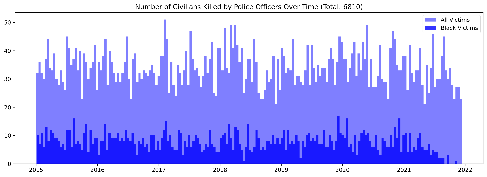
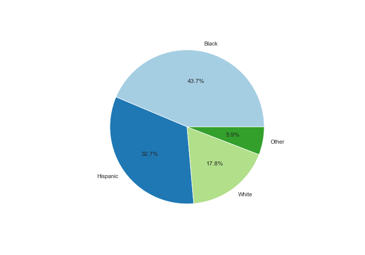
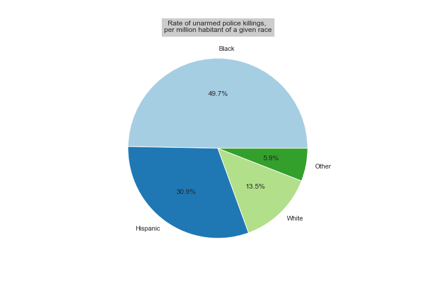
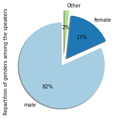
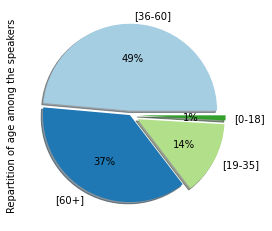
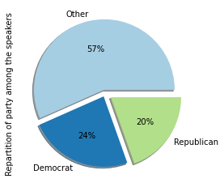
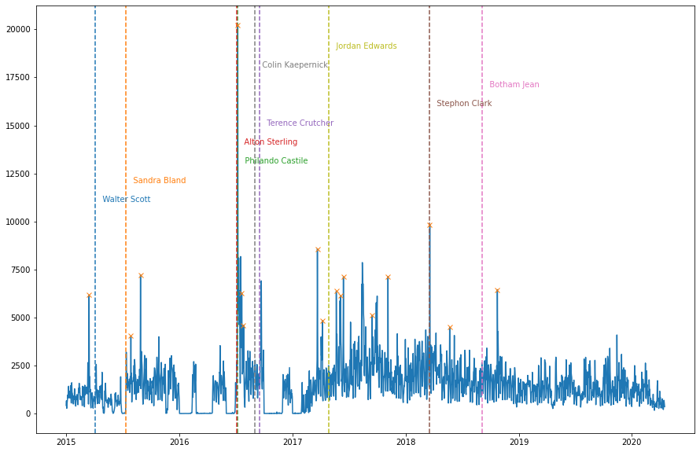
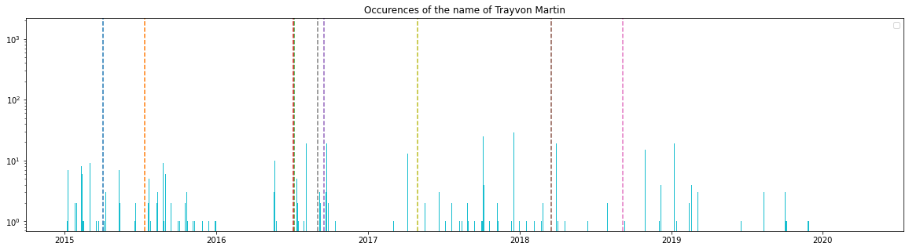
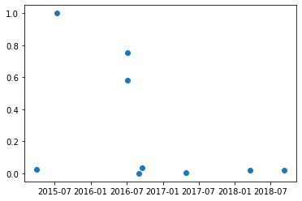

## _Abstract : needs to be modified_

_In 2013, the Black Lives Matter (BLM) movement emerged in response to the police brutality experienced by Black people in the United States. The movement has become increasingly popular, presumably due to the myriad protests that have been organized since its inception. However, its popularity has sparked mixed sentiment within America’s socio-political landscape. Thus, we analyze how select mediatized protests have impacted discourse on the movement. We focus on the fact that although a civilan is killed by the police ****EVERY SINGLE DAY,**** the media only sensationalizes certain cases, and then moves on and stops discuissing the problem. Additionally, we show how too much attention is given to "counter-movements" and we see the efforts to diminsh the impact of Black Lives Matter.

# Fight against police brutality should be an everyday struggle

Alton Sterling, Stephon Clark, or more recently Breonna Taylor and Georges Floyd have tragically become symbols of the struggle against police violence. The US police is indeed often involved in a lot of cases of racial persecution towards minorities, and in reaction, there have been many protests to try to change this constant harassment. 

According to the Washington Post [1], 918 persons have been shot and killed by police in the past year. By doing a short analysis between 2015 and today with their database and normalizing each killed race by the number of the US inhabitant of the same race, it shows that black Americans are killed by police more than twice as high as the rate for white Americans.
 




If we look at the proportion of people killed by the police according to their race is higher than white people. Some detractors of the BLM movement might be tempted to say that the police officers did not have other choice but to kill them, justifying their action by self-defense. However, if the victims are unarmed, then they can not be threatening the level of the police officer. Let's then look at the proportion if unarmed people. This gives the plot on the right. Unarmed Black people are 3 times more likely to be killed by the US police than white people. Where is the self-defense here ? 

Proportion of killed people per million inhabitants                                                |  Proportion of unarmed killed people per million inhabitants
:-------------------------------------------------------------------------:|:---------------------------------------------------------------:
  |  

## Black Lives Matter movement in Quotebank

Quotebank is a dataset of quotations gathered from the US news. Police violence is a controversal issue in the US, and there are of course people defending the civil rights of all citizens in the US, no matter the color of their skin, and the ones that criticize the movement and the protests linked to it. The quotations are therefore a mix of support and criticism of the BLM movement. The dataset we used contains the years from 2015 to 2020 and the quotations related to the BLM movement and police brutality in a more general way and contains about 700000 quotations. This shows that the topic is not anecdotal, and whether the speakers of the quotations talk about this topic in a positive or negative way, they talk about it a lot, but is it enough? Focusing on specific periods of time, we aim to show that everytime a Black person is killed by the police, the subject is more present in the news. Do Americans need Black young people to die to take action against police violence? As shown on the map above, many Black people are killed by the police every year, but are their deaths less significant if they are not mediatised ? 

### Who is talking about BLM and protest brutality






Not surprisingly, the proportion of males in our speakers is much higher than other genders, however, in the US men are yet not more numerous than women for example. One explanation could be that they are more likely to talk to the press, or maybe they are taken more seriously than other genders. The topic of police brutality does not make an exception, as it is mosly discussed by males. 

Moreover, most people mentioning the topic are middle aged and old people. Once again, this is probably representative of the proportion of this category of people in the news in general. 

Those categories of people are the ones that are the less often discredited and whose voices are listened to in the press. They should raise awareness about racism. Not only in the days or weeks following the terrible death of a 12-year-old Black boy to bring the issue to the table, not when the hot topic is already all over the twittosphere, not when it's too late. 

### Their lives matter !

There have been many unlegitimate police killings, some have made the headlines while others have been hidden under the carpet. We do not consider those last cases less important than the more mediatized death, but for a better analysis we focused on people that tragically became famous after beeing unlegitimately killed by police, to highlight the tendency of the speakers wait for a mediatized death to take action. 

The analysis of the dataset and our knowledge of US history gave us the following list of sadly famous people, associated to the date on which they were killed : Walter Scott, Sandra Bland, Philando Castile, Alton Sterling, Terence Crutcher, Stephon Clark, Botham Jean, Jordan Edwards. We added to this list the name of Colin Kaepernick and associated it with the date on which he knelt at the start of NFL games to protest against police brutality.



Here are all the occurrences of quotations talking about the BLM movement and police brutality, on top of which we can see the dates at which the most mediatized victims of police abuse died, and also the protestation of Colin Kaepernick. It clearly appears that the pic in occurrences of our topic matches those dates, this emphasizes the fact that our speakers tend to discuss police brutality only because some totally unjustified deaths remind them that racism is all over the country. 

The quotations we had were only covering the years from 2015 to 2020. Nevertheless, victims of police violence did not start in 2015. For example, the filtered dataset is refering a lot to Trayvon Martin, a young boy killed in February 2012 and whose killer was never charged with murder. His name is specifically mentionned in the days following the particular dates we selected.





 

It also seems that people protesting about BLM or being killed in those years had a higher impact on our speakers. 


## Welcome to GitHub Pages

You can use the [editor on GitHub](https://github.com/ClaraLeDraoulec/BLM-Data-Story/edit/gh-pages/index.md) to maintain and preview the content for your website in Markdown files.

Whenever you commit to this repository, GitHub Pages will run [Jekyll](https://jekyllrb.com/) to rebuild the pages in your site, from the content in your Markdown files.

### Markdown

Markdown is a lightweight and easy-to-use syntax for styling your writing. It includes conventions for

```markdown
Syntax highlighted code block

# Test 1
## Header 2
### Header 3

- Bulleted
- List

1. Numbered
2. List

**Bold** and _Italic_ and `Code` text

[Link](url) and 
```

For more details see [Basic writing and formatting syntax](https://docs.github.com/en/github/writing-on-github/getting-started-with-writing-and-formatting-on-github/basic-writing-and-formatting-syntax).

### Jekyll Themes

Your Pages site will use the layout and styles from the Jekyll theme you have selected in your [repository settings](https://github.com/ClaraLeDraoulec/BLM-Data-Story/settings/pages). The name of this theme is saved in the Jekyll `_config.yml` configuration file.

### Support or Contact

Having trouble with Pages? Check out our [documentation](https://docs.github.com/categories/github-pages-basics/) or [contact support](https://support.github.com/contact) and we’ll help you sort it out.
