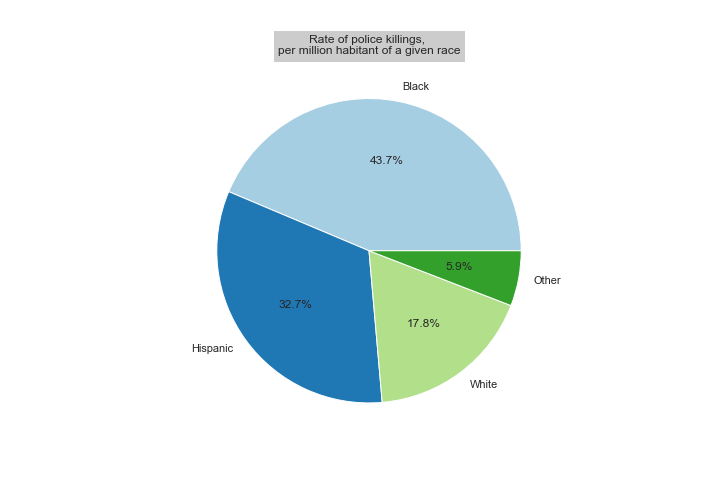

## _Abstract_

## Introduction
Alton Sterling, Stephon Clark, or more recently Breonna Taylor and Georges Floyd have tragically become symbols of the struggle against police violence. The US police is indeed often involved in a lot of cases of racial persecution towards minorities, and in reaction, there have been many protests to try to change this constant harassment. According to the Washington Post [1], 918 persons have been shot and killed by police in the past year. By doing a short analysis between 2015 and today with their database and normalizing each killed race by the number of the US inhabitant of the same race, it shows that black Americans are killed by police more than twice as high as the rate for white Americans.
On the right, taking into account only those who are not armed (even not a knife) for questions of legitimacy,  unarmed black people are 3 times more likely to be killed by US police than white people.
The interpretation of these results shows that there is indeed a form of harassment and injustice since black people are much more subject to being shot than white people. 


Armed and unarmed                                                         |  Unarmed
:-------------------------------------------------------------------------:|:---------------------------------------------------------------:
  |  


## Welcome to GitHub Pages

You can use the [editor on GitHub](https://github.com/ClaraLeDraoulec/BLM-Data-Story/edit/gh-pages/index.md) to maintain and preview the content for your website in Markdown files.

Whenever you commit to this repository, GitHub Pages will run [Jekyll](https://jekyllrb.com/) to rebuild the pages in your site, from the content in your Markdown files.

### Markdown

Markdown is a lightweight and easy-to-use syntax for styling your writing. It includes conventions for

```markdown
Syntax highlighted code block

# Test 1
## Header 2
### Header 3

- Bulleted
- List

1. Numbered
2. List

**Bold** and _Italic_ and `Code` text

[Link](url) and 
```

For more details see [Basic writing and formatting syntax](https://docs.github.com/en/github/writing-on-github/getting-started-with-writing-and-formatting-on-github/basic-writing-and-formatting-syntax).

### Jekyll Themes

Your Pages site will use the layout and styles from the Jekyll theme you have selected in your [repository settings](https://github.com/ClaraLeDraoulec/BLM-Data-Story/settings/pages). The name of this theme is saved in the Jekyll `_config.yml` configuration file.

### Support or Contact

Having trouble with Pages? Check out our [documentation](https://docs.github.com/categories/github-pages-basics/) or [contact support](https://support.github.com/contact) and we’ll help you sort it out.
